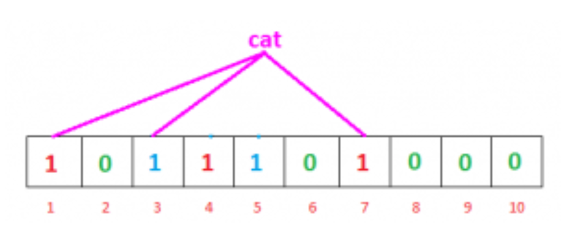

# Bloom Filter

General use case is to detect the existence of data in a set. For example, detecting if a username is taken.

The price we pay for efficiency is that it is probabilistic in nature that means, there might be some **False Positive** results. 
False positive means, it might tell that given username is already taken, but actually it’s not.

## Algorithm

- Init a bit array of size `n`, `[0, 0, ..., 0]`.
- Select `k` hash functions.
- When adding a value, set the `n` hashed location to `1` on the bit array. `hash1(x) % n`, `hash2(x) % n`, ..., `hashk(x) % n`
- When getting a value, check if the hashed locations on the bit array:
  - if all the locations are `1s`, then the value might exist.
  - if any of the location is `0`, then the value must not exist.

If we check the bit array, bits at these indices are set to 1, but we know that `cat` was never added to the filter. Bit at index 1 and 7 was set when we added `geeks` and bit 3 was set we added `nerd`. 
 
