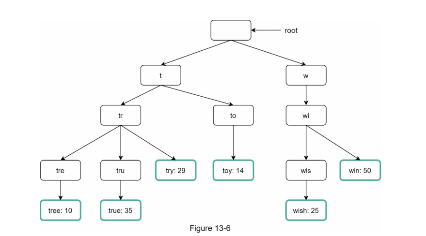

# Trie

- A trie is a tree-like data structure. 
- The root represents an empty string. 
- Each node stores a character and has 26 children, one for each possible character. 
- Each tree node represents a single word or a prefix string.

Use case Search engine completion. A trie with word frequencies.

Time complexity of finding the top `k` words given a prefix of length `p`.

- Find the prefix in the trie `O(p)`.
- Find all valid child that is a word `O(c)` where `c` is the number of children.
- Sort them by frequency `O(clogc)`.