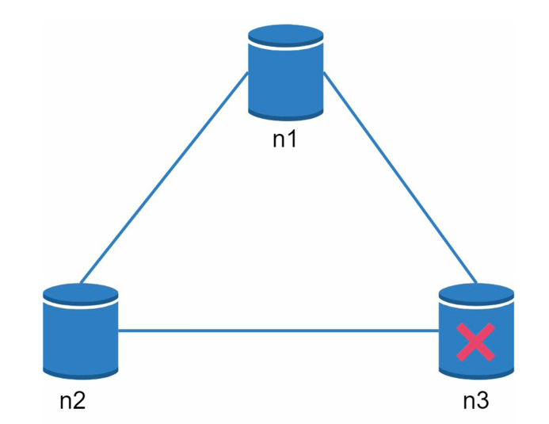

# CAP

CAP represents `consistency`, `availability` and `partition tolerance` in distributed database. And it is proved that only 2
of the 3 can be reached in a distributed system.

- **Consistency**: consistency means all clients see the same data at the same time no matter which node they connect to.

- **Availability**: availability means any client which requests data gets a response even if some nodes are down.

- **Partition Tolerance**: a partition indicates a communication break between two nodes. Partition tolerance means the system continues to operate despite cross node connection breaks.

Consider in a distributed database, data are replicated across 3 nodes (always partitioned).

If we choose consistency over availability (e.g. banking system). In times when `n3` is down, data modifications on `n3` will
be locked and `n1` and `n2` should not be available until `n3` recovers and finishes its operations to ensure data in every node
is exactly the same. During the recovery phase, the client would receive errors.

However, if we choose availability over consistency, even when `n3` is down, operations in `n1` and `n2` can still operate as usual, thus
resulting in data lagging across the nodes.