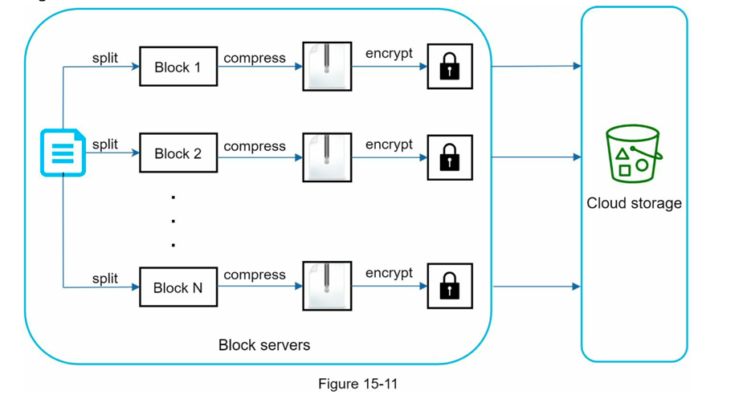

# Large File Storage

Sending the whole file on each update consumes a lot of bandwidth. 
Two optimizations are proposed to minimize the amount of network traffic being transmitted:

- **Delta sync**: When a file is modified, only modified blocks are synced instead of the whole file using a sync algorithm.
- **Compression**: Applying compression on blocks can significantly reduce the data size. Thus, blocks are compressed using compression algorithms depending on file types. For example, gzip and bzip2 are used to compress text files.

A large file will be split into smaller blocks and compressed before uploading to storage.
