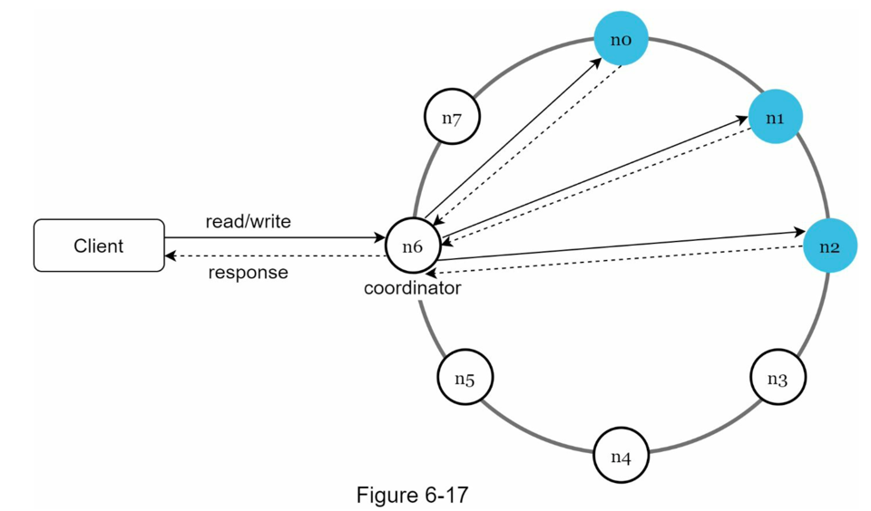
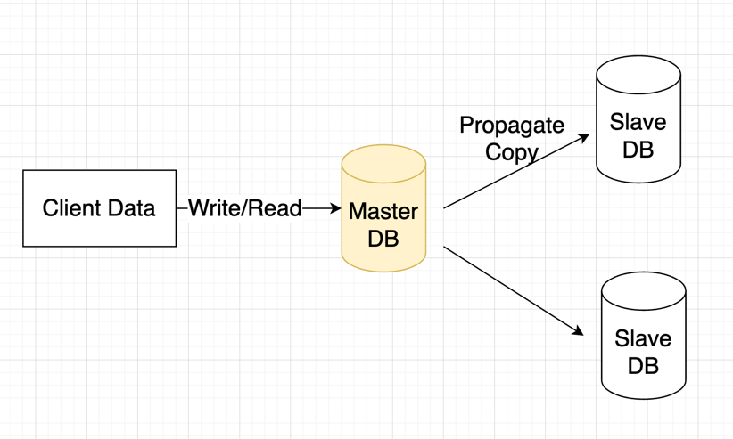
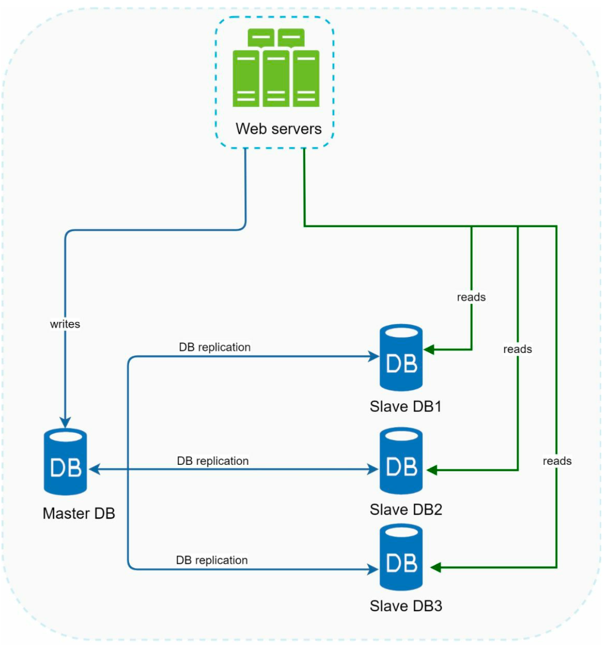
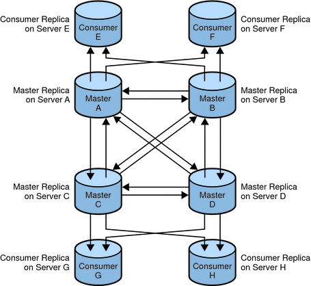
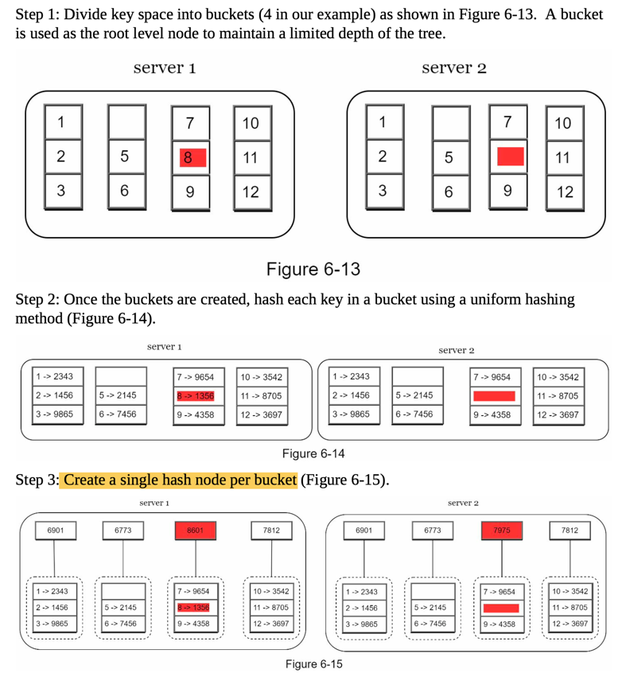
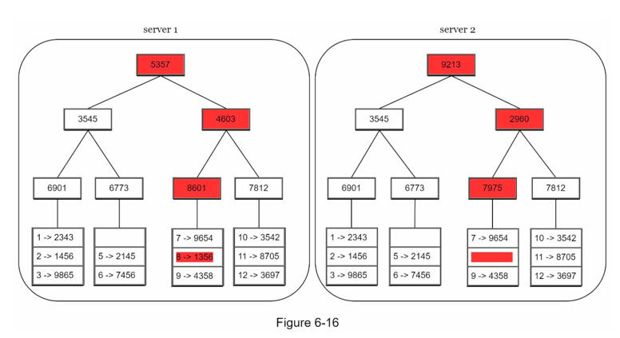

# Replication (Availability)

## Overall Architecture

- Clients communicate with the key-value store through simple APIs: get(key) and put(key,
value).
- A coordinator is a node that acts as a proxy between the client and the key-value store. Nodes are distributed on a ring using **consistent hashing**.
- The system is completely decentralized so adding and moving nodes can be automatic. Data is replicated at multiple nodes.
- There is no single point of failure as every node has the same set of responsibilities.

## Master-Slave
Master node would take in both `Read/Write`, while Slave node only accepts `Read`.
- **Only master node can modify the data**.

## Master-Master
All members are responsive to client data queries.
- **all members can modify the data.**

### Advantages

- **Availability**: If one master fails, other masters continue to update the database. **Better throughput**.
- **Distributed Access**: Masters can be located in several physical sites, i.e. distributed across the network.

### Disadvantages

- **Consistency**: Most multi-master replication systems are only loosely consistent, i.e. lazy and asynchronous, **violating ACID properties.**
- **Performance**: Eager replication systems are complex and **increase communication latency.**
- **Integrity**: Issues such as conflict resolution can become intractable as the number of nodes involved rises and latency increases.

### Quorum-based voting for replica control

Each of the node that holds a copy would have one vote. Let's say a data item is copied to `V` nodes, so
in total there are `V` votes. And the data item is written to `V_w` nodes and are read from `V_r` node,
the following condition must be satisfied,

- `V_w` + `V_r` > `V`; Ensures strong consistency as at least one node holds the latest data.
- `V_w` > `V/2`.

**Cases**

- If `V_w = 1` and `V_r = V`, then it is optimised for write, as the coordinator only needs to wait for ACK from one node when written.
- If `V_r = 1` and `V_w = V`, then it is optimised for read.

Together with **data versioning**, it ensures at least the latest data can be fetched from at least one node.

## Difference Comparison

`Merkle tree` can be used to compare data inconsistency in 2 different servers. `Merkle tree` hashes the values of data node and
walk all the way up to root nodes and compare their hashes.

During comparison, work downwards from root node and compare the hashes, continue way down only when hashes are different until
hit the leave bucket nodes. And synchronise the data in those buckets. 

The amount of data needed to be synchronized **is proportional to the differences between the two replicas**, and not the amount of data they contain.
