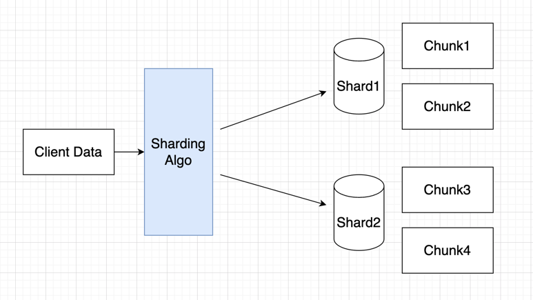
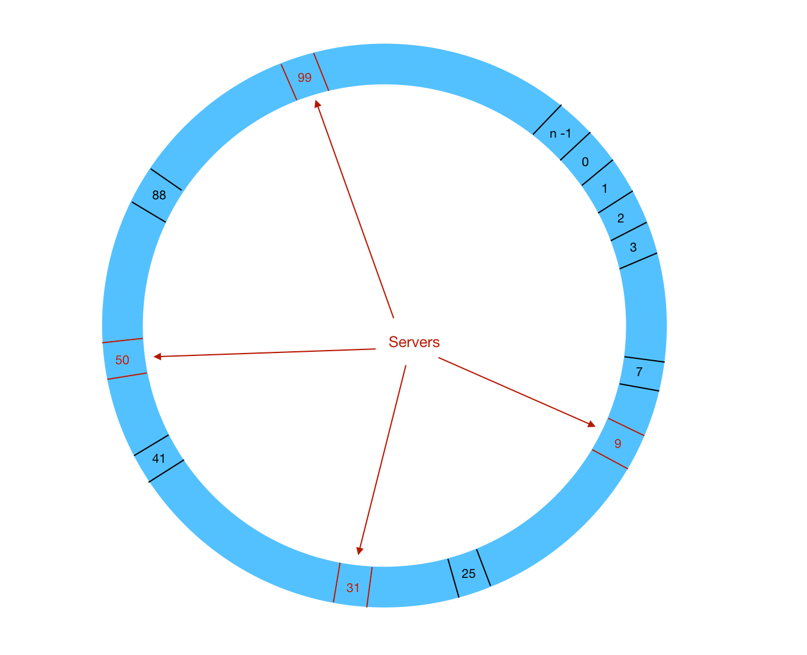
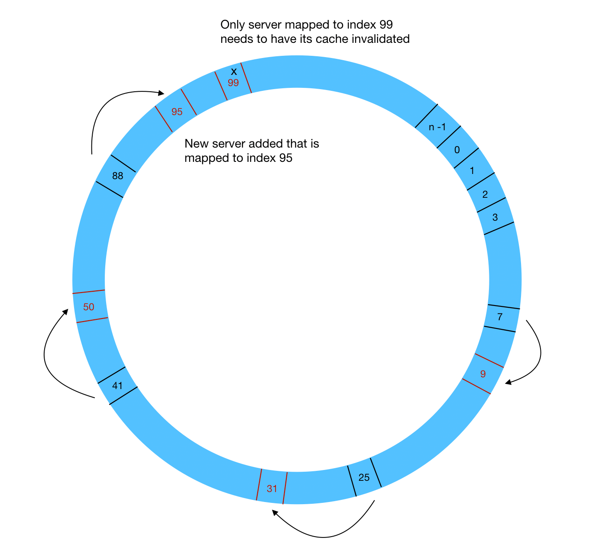
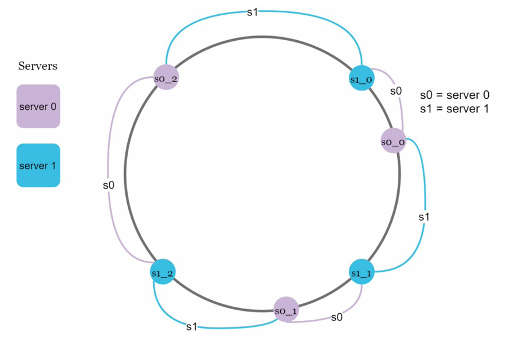

# Sharding (Scaling)

Applied in **scaling** issue. Spread data into multiple nodes, each of them store part of the total data.

## Sharding Algorithm

- Key-based sharding (hashing).
- Range-based sharding.

In the data sharding, the shard-key should be carefully chosen with

- A key that is used in queries a lot.
- Has great cardinality (granularity) so that data can be dispersed in different shards.

# Dynamic/Consistent Hashing

Split data into `virtual nodes`, and each `physical node(machine)` would take a series of `virtual nodes`. 
For each request, we simply find the nearest server to its right, in a clockwise fashion.

Upon adding new server, at most one other server will be impacted by a change 
in the number of servers.

The example below a new server is added, and it maps to index `95`. 
The request that is mapped to index `88` is now served by the new server mapped to index `95`, 
instead of the previous one that was mapped to index `99`.

**Basic Steps**

- Map servers and keys on to the ring using a **uniformly distributed hash function**.
- To find out which server a key is mapped to, go **clockwise** from the key position until the first server on the ring is found.

**Drawback**

- It is possible some nodes have fairly large or small partition.
- It is possible key distribution is not even.

**Virtual Nodes**

Virtual nodes solve the above problems by introducing more nodes for each server.

Instead of using s0, we have s0_0, s0_1, and s0_2 to represent server 0 on the ring. Similarly, s1_0, s1_1, and s1_2 represent server 1 on the ring.

As the number of virtual nodes grow, the standard deviation of partition size decreases, resulting in more
evenly distributed partitions.

## Issues

**Join and de-normalization**: Once a database has been sharded across multiple servers, 
it is hard to perform join operations across database shards. **A common workaround is to 
de-normalize the database so that queries can be performed in a single table.**

**Celebrity problem**: This is also called a hotspot key problem. 
Excessive access to a specific shard could cause server overload. 
Imagine data for Katy Perry, Justin Bieber, and Lady Gaga all end up on the same shard. 
For social applications, that shard will be overwhelmed with read operations. 
To solve this problem, **we may need to allocate a shard for each celebrity.** 
Each shard might even require further partition.
