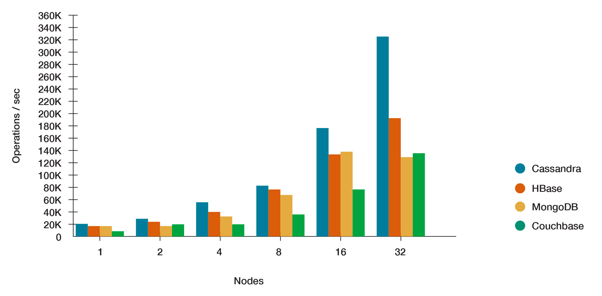

# SQL vs. NoSQL

## SQL

- More structured data.
- Strong consistency (ACID).
- Satisfy complex join operation.
- Scaling: need to implement extra sharding logic.

## NoSQL

- Allow loose and flexible structured data.
- Easier to scale, mostly with build-in scaling strategy.
- Faster performance if well-designed.
- Complex join can be hard, may need to extra implement in the program.

## Write Throughput

### SQL
[reference](https://stackoverflow.com/questions/61407469/how-many-writes-per-second-to-a-mysql-server-can-i-reasonably-expect)

Estimated `1000w/second` using `SSD` (roughly at thousandth level).

### NoSQL

