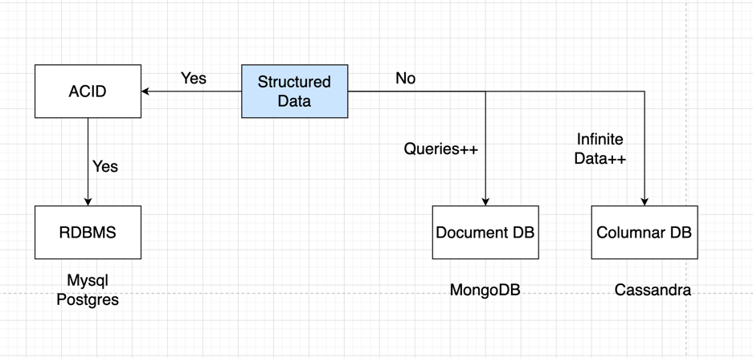
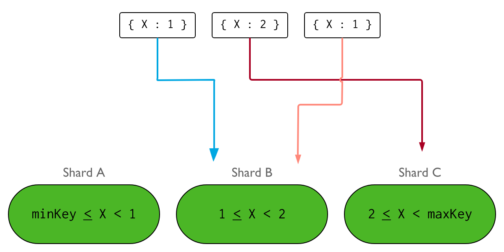
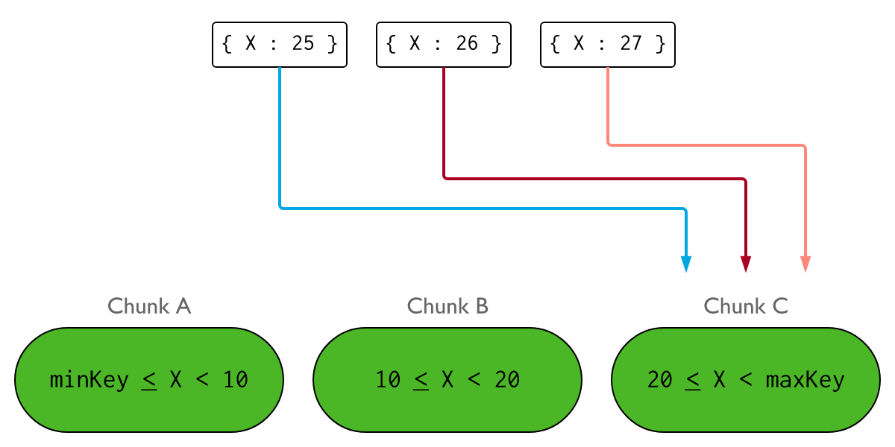

# When/Why/Which

When read/write queries are a lot, NoSQL DB with distributed scaling strategy would be advantageous
as read/write load would be distributed to different shards.

## When to use Caching

Consider using cache when data is read frequently but modified infrequently(High read). 
Since cached data is stored in **volatile memory**, a cache server is not ideal for persisting data. 
For instance, if a cache server restarts, all the data in memory is lost. 
Thus, important data should be saved in persistent data stores.

## NoSQL Shard Key Selection

- Choose shard key with high cardinality so that the data can be divided into more shards.

The following image illustrates a sharded cluster using the field X as the shard key.
If X has low cardinality, the distribution of inserts may look similar to the following

- Do not choose monotonically increasing/decreasing fields as shard keys.

If a shard key is monotonically increasing, the new inserts would always route to the last chunk.

The following image illustrates a sharded cluster using the field X as the shard key. 
If the values for X are monotonically increasing, the distribution of inserts may look similar to the following

