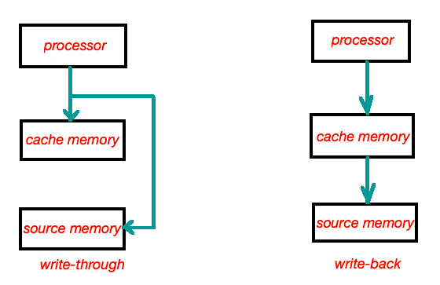

# Write-Back Cache vs. Write-Through Cache

**Write-through**: Data is written to both cache and backend database before getting back to client. Longer latency
as it has wait both write destination is done. Shall be used when write traffic is not heavy.

**Write-back**: Data is written to cache only. Data persists to database only after item is evicted from the cache.
Faster but could cause data loss when caching system down.

