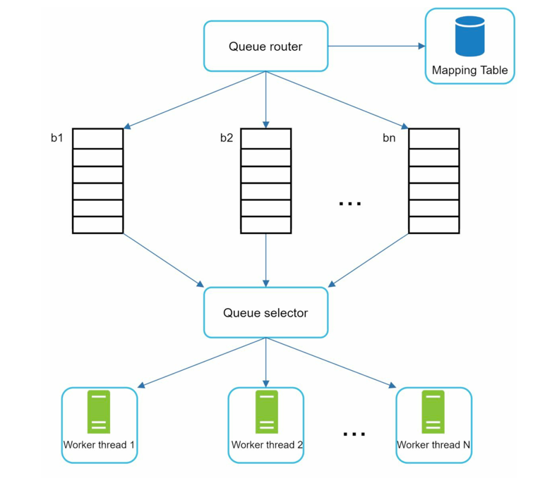

# Politeness

Make call to a website(or other objects) one at a time.
Each website would go through a queue router and adds to the same FIFO queue. In this case, the worker thread
would only process one item from the same website at a time.

