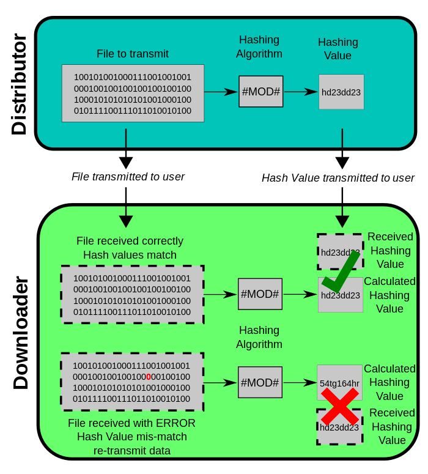

# MD5

One application is compare the `checksum` of whether the downloaded file is intact or as expected.



The 128-bit (16-byte) MD5 hashes (also termed message digests) are typically represented as a sequence of 
32 hexadecimal digits.
```
MD5("The quick brown fox jumps over the lazy dog") = 9e107d9d372bb6826bd81d3542a419d6
```
Even a small change in the message will (with overwhelming probability) result in a 
mostly different hash, due to the avalanche effect. 
For example, adding a period to the end of the sentence:

```
MD5("The quick brown fox jumps over the lazy dog.") = e4d909c290d0fb1ca068ffaddf22cbd0
```

The hash of the zero-length string is:

```
MD5("") = d41d8cd98f00b204e9800998ecf8427e
```