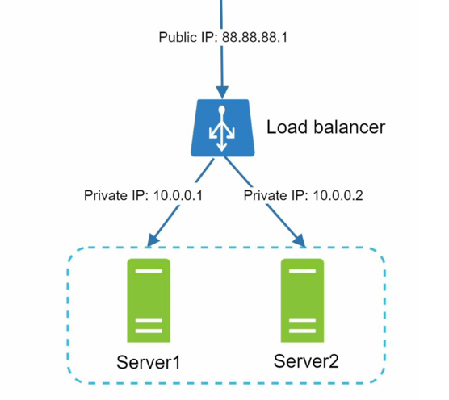

# Knowledge

For better security, private IPs are used for communication between servers. **A private IP is an IP address reachable only 
between servers in the same network**; however, it is unreachable over the internet. The load balancer communicates with web servers through private IPs.
