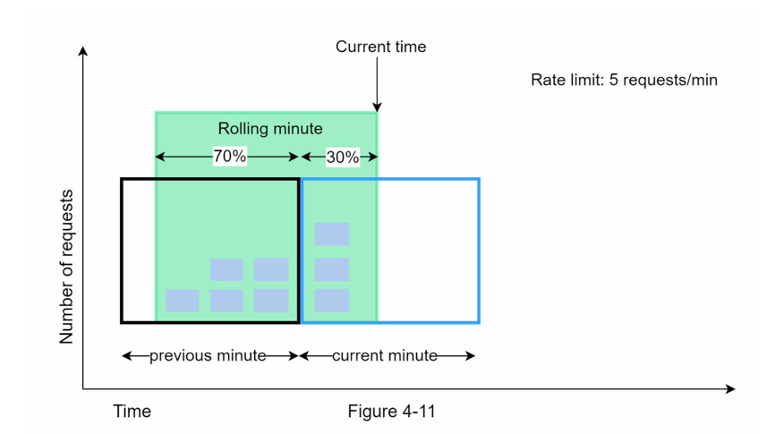

# Algorithms

## Token Bucket

Two key parameters are required:

- **Bucket size**: The maximum number of tokens allowed in the bucket.
- **Refill rate**: Refill rate.

A bucket will be initialised with a fixed size, and periodically, a fixed number of tokens would be refilled
into bucket, and each request would take one token, and when tokens are all taken, the request would be dropped.

In this example, the token bucket size is 4, and the refill rate is 4 per 1 minute.

## Leaky Bucket

Normally implemented with a FIFO queue. And requests are processed at a fixed rate, when the queue is full, new requests are dropped.

- When a request arrives, the system checks if the queue is full. If it is not full, the request is added to the queue.
- Otherwise, the request is dropped.
- Requests are pulled from the queue and processed at regular intervals.

**Pros:**

- Memory efficient given the limited queue size.
- Requests are processed at a fixed rate therefore **it is suitable for use cases that a stable outflow rate is needed**.

**Cons:**

- A burst of traffic fills up the queue with old requests, and if they are not processed in time, recent requests will be rate limited.
- There are two parameters in the algorithm. It might not be easy to tune them properly.

## Fixed Window Counter

It divides the time into fixed window size, where in each slot there allows only fixed number of requests.

Major drawback is at the edges of the window, there could be more requests than allowed quota.

## Sliding Window

It keeps track of the request timestamp and keeps counting the number of requests in the log.

For example, suppose the rate limit is `2 reqs/min`, when a new reqeust `(req_a, t)` comes in, it will be inserted
into the log, and it will count the number of requests in `[t-60s, t]`, if it exceeds `2`, the request will
be denied, otherwise will be processed.

**Pros:**
- Rate limiting implemented by this algorithm is **very accurate**. In any rolling window, requests will not exceed the rate limit.

**Cons:**
- The algorithm **consumes a lot of memory** because even if a request is rejected, its timestamp might still be stored in memory.

## Counter Sliding Window

Assume the rate limiter allows a maximum of 7 requests per minute, and there are 5 requests in the previous minute and 3 in the current minute. For a new request that arrives at a 30% position in the current minute, the number of requests in the rolling window is calculated using the following formula:

- Requests in current window + requests in the previous window * overlap percentage of the rolling window and previous window
- Using this formula, we get `3 + 5 * 0.7% = 6.5` request. Depending on the use case, the number can either be rounded up or down. In our example, it is rounded down to 6.

**Pros**
- It smooths out spikes in traffic because the rate is based on the average rate of the previous window.
- Memory efficient.

**Cons**
- It only works for not-so-strict look back window. 
It is an approximation of the actual rate because it assumes requests in the previous window are evenly distributed.

