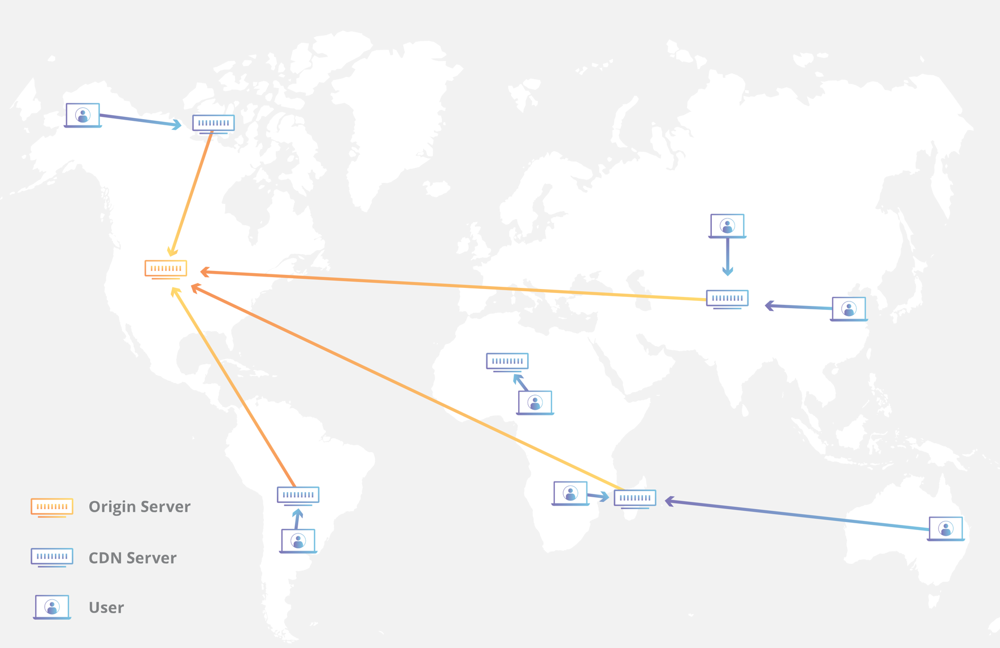

# CDN(Content Delivery Network)

A CDN is a geographically distributed group of servers work together to delivery content faster.
Users will be route to geographically the closest server.

## How does a CDN work?

At its core, a CDN is a network of servers linked together with the goal of delivering content as quickly, cheaply, reliably, and securely as possible. In order to improve speed and connectivity,
a CDN will place servers at the exchange points between different networks.

## Push CDN
Proactively update content whenever changes occur on the server.

Sites with a small amount of traffic or sites with content that isn't often updated work well with push CDNs.

## Pull CDN

It updates content only when a user request for that particular content(lazily pull), after that the
content will be cached with given TTL. Newly updated content will only be uploaded to CDN after TTL or first-time requested.

Sites with heavy traffic work well with pull CDNs, 
as traffic is spread out more evenly with only recently-requested content remaining on the CDN.

## Cost Optimization
CDN is expensive and to save cost, we can 
1. Serve only popular content with CDN and unpopular ones with video servers (long-tail distribution).
2. For less popular content, we may not need to store many encoded video versions. Short videos can be encoded on-demand.
3. Some videos are popular only in certain regions. There is no need to distribute these videos to other regions.