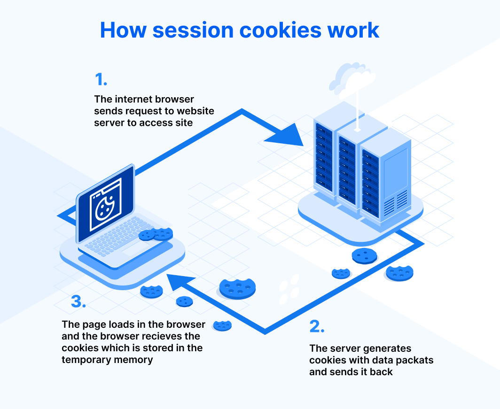

# Cookie Session

A cookie is a text file that stores certain information.

The session cookie is a server-specific cookie that cannot be passed to any machine other than 
the one that generated the cookie. The server creates a **“session ID”** which is a randomly 
generated number that temporarily stores the session cookie. 

## What is the purpose of session cookies?

A website itself cannot track a user’s movement on its webpage and treats each new page 
request as a new request from a new user. Session cookies allow websites to remember users within a website 
when they move between web pages. 

These cookies tell the server what pages to show the user so the user 
doesn’t have to remember where they left off or start navigating the site all over again. 
Therefore, without session cookies, websites have no memory. 
Session cookies are vital for user experience on online shops and websites when the functionalities depend on 
users’ activities.