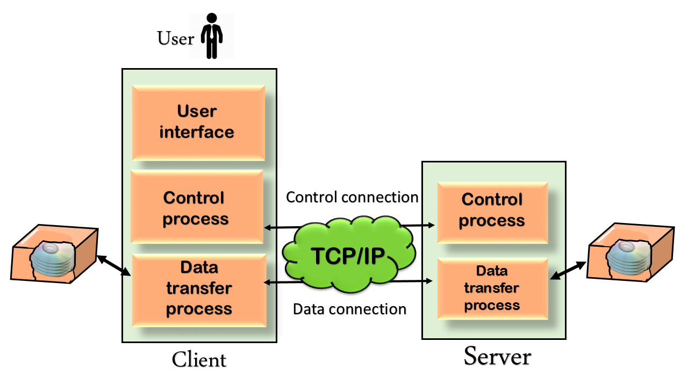

# File Transfer Protocol (FTP)

A protocol built upon `TCP/IP` that is used for file transfer between clients and servers.

## Why FTP?

The two systems that doing file transfer may
1. Operate on different systems.
2. Have different conventions representing data and text.
3. Have different folder structure.

FTP establishes 2 connects

1. **control connection**: allow to send a command through this connection and is connected throughout the 
interactive FTP session.
2. **data connection**: used for data transfer and is closed after file transfer is done.

