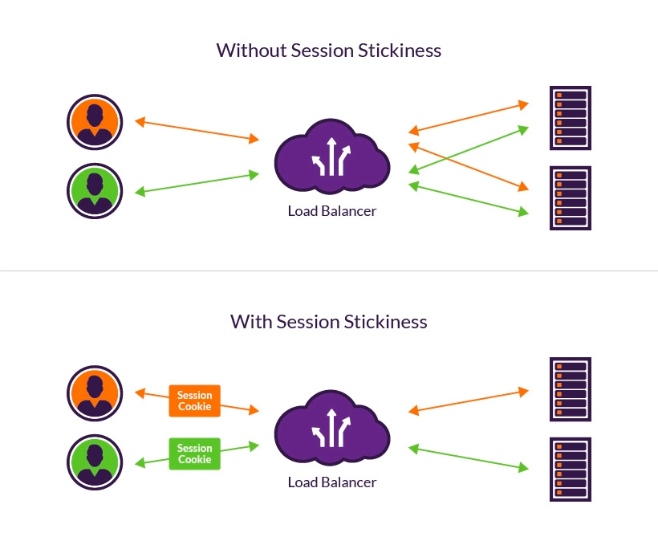

# Sticky Session

Load balancer creates an affinity between client and a server in a fixed period of time.

With sticky sessions, a load balancer assigns an identifying attribute to a user, typically by issuing a cookie or by tracking 
their IP details. Then, according to the tracking ID, a load balancer can start routing 
all the requests of this user to a specific server for the duration of the session.

While HTTP/HTTPs is stateless, sticky session enables the server side to keep the state of a user(personalized data).
Otherwise, the server would have to maintain the data in a distributed manner, which is less efficient.

## Duration-based session persistence

Your **load balancer issues a cookie** that defines a specific timeframe for session stickiness. 
Each time the load balancer receives a client request, it checks whether this cookie is present.

After the specified duration elapses and the cookie expires, the session is not sticky anymore.

## Application-controlled session persistence

Your **application generates a cookie** that determines the duration of session stickiness.
The load balancer still issues its own session cookie on top of it, but it now follows the 
lifetime of the application cookie.