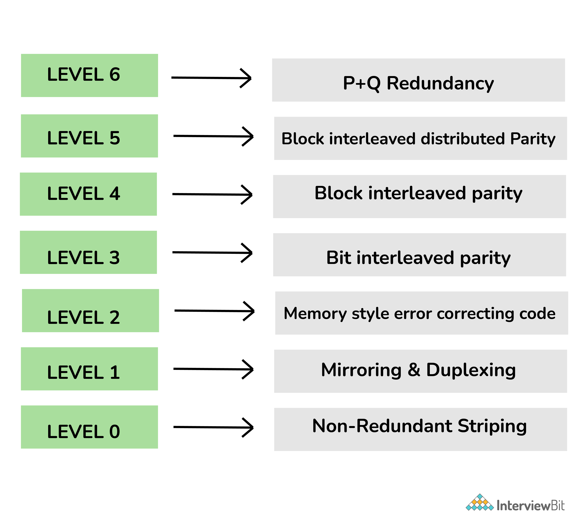

# RAID (Redundant Arrays of Independent Disks)

RAID(Redundant Arrays of Independent Disks) is a technique of combining multiple hard disks together to achieve data redundancy and reduce data loss
on the file system. It balances system performance, data storage and system reliability.

## RAID Levels

- RAID 0 - Non-redundant striping: This level is used to increase the performance of the server.
- RAID 1 - Mirroring and duplexing: This level is also known as disk mirroring and is considered the simplest way to implement fault tolerance.
- RAID 2 - Memory-style error-correcting codes: This level generally uses dedicated hamming code parity I.e., a liner form of error correction code.
- RAID 3 - Bit-interleaved Parity: This level requires a dedicated parity drive to store parity information.
- RAID 4 - Block-interleaved Parity: This level is similar to RAID 5 but the only difference is that this level confines all parity data to a single drive.
- RAID 5 - Block-interleaved distributed Parity: This level provides far better performance than disk mirroring and fault tolerance.
- RAID 6 - P+Q Redundancy: This level generally provides fault tolerance for two drive failures.
