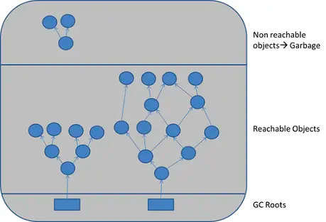
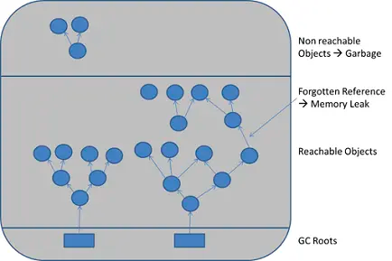
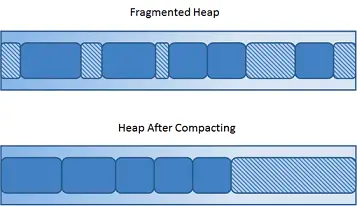

# Garbage Collection

Garbage collection collects the unused memory on the **heap** which is used for dynamic memory allocation.
_It simply marks the unused memory space as free instead of releasing the memory back to the OS._

## GC Roots

For Java, the JVM keeps a reference tree, where the GC roots includes,

1. Local variables.
2. Main thread.
3. Static variables.



## Sweeping Away Garbage

When a program runs, the JVM intermittently starts a `mark-and-sweep` algorithm.

- Traverse from the GC roots to all the referenced objects.
- What is not referenced will be collected (Memory will be reclaimed), marked as free memory.



## Downside of GC

The system needs to intermittently pause to allow garbage collection which, when the live referenced objects are huge
would cause to performance issues.

```angular2html
1% execution time of GC would loss 20% throughput on a 32-processor system (suspending 32 running threads). 
```

### Fragmented Memory and Compaction

Repeated allocation and reclaim of memory space would lead to fragmented memory on the heap which would cause,

1. Performance issue. Longer time to find big enough space to allocate memory to an object.
2. Allocation errors. When the space is so fragmented that the system is unable to find a sufficient block of memory space.

Compaction would align all objects address to one end of the heap and close all the holes at the cost of
a even longer GC time.

