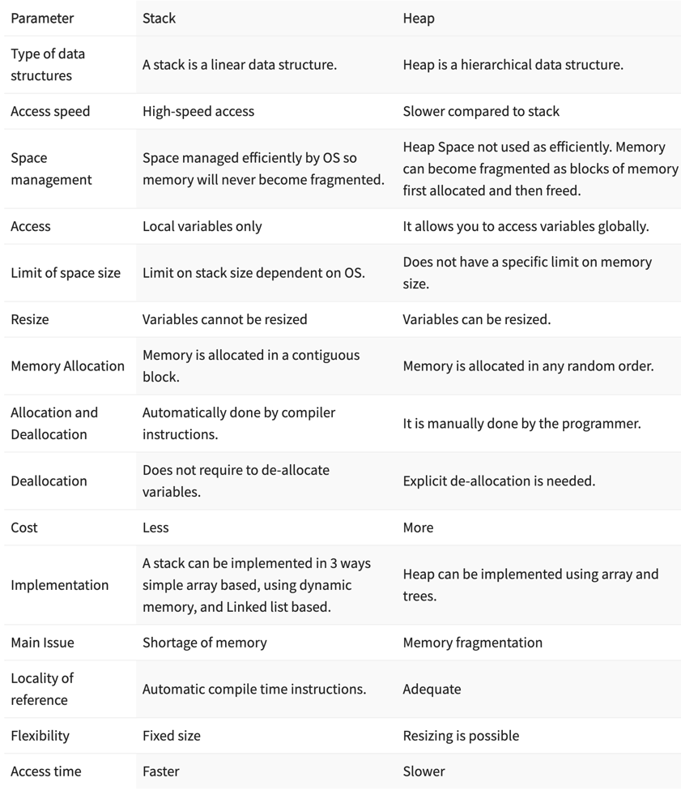

# Heap vs. Stack

Stack has auto memory allocation and de-allocation while heap needs explicit clearance(like garbage collection).

Variables allocated to stack have fixed size and are immutable. They are cleared after use. For example, 
calling a function, the local variables in the function would be cleared after function call ends.

The heap here is different from the data structure heap.