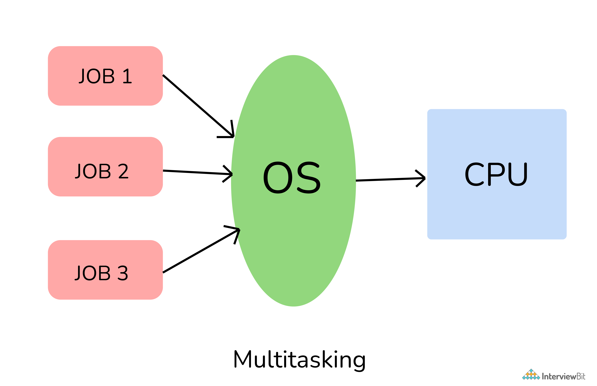
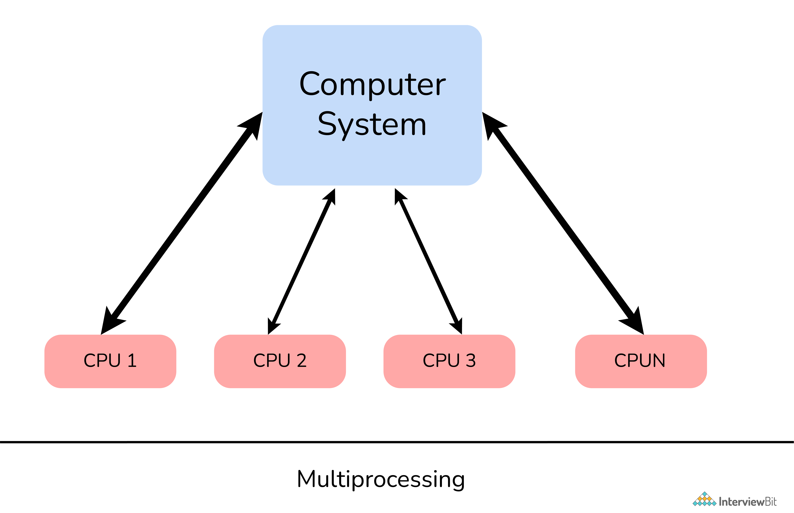

# Multitasking vs. Multiprocessing

## Multitasking

Multitasking rapidly switches among different task using one CPU.

## Multiprocessing

Multiprocessing run programs simultaneously using multiple CPUs.

