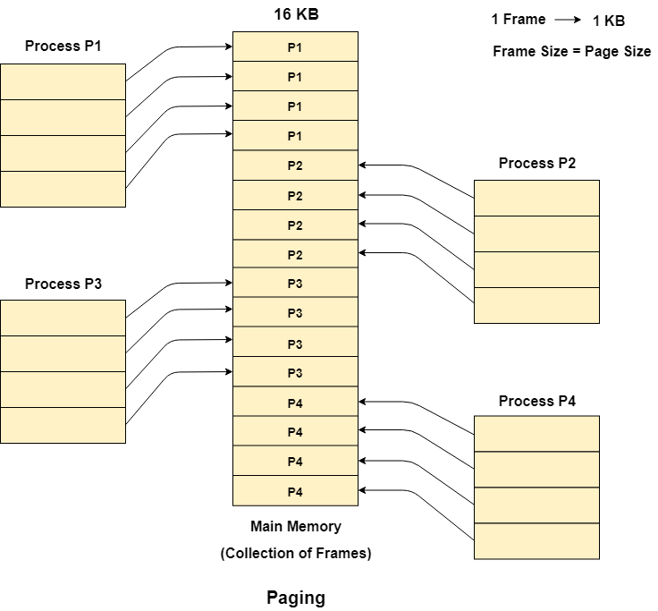
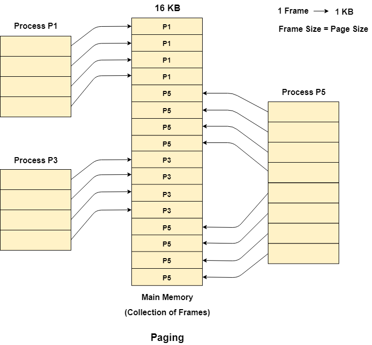

# Paging

Paging is a memory management technique where a computer loads data from secondary memory to primary
memory.

Primary storage data is temporary and is frequently accessed by applications or other hardware systems. It is typically stored in random access memory (RAM) for fast retrieval. Secondary storage is where data in a computer is kept for longer periods of time. Secondary storage is typically slower than primary. 
A typical example of secondary memory could be a solid-state drive (SSD), for example.

- The unit of a logical memory is called page.
- The unit of a physical memory is called frame.

During program execution, a process can be divided into multiple pages and then it can be assigned to
non-contiguous frames located on the physical memory.

## Example

Let us consider the main memory size 16 Kb and Frame size is 1 KB therefore the main memory will be divided into the collection of 16 frames of 1 KB each.

There are 4 processes in the system that is P1, P2, P3 and P4 of 4 KB each. Each process is divided into pages of 1 KB each so that one page can be stored in one frame.

Initially, all the frames are empty therefore pages of the processes will get stored in the contiguous way.

Frames, pages and the mapping between the two is shown in the image below.

Let us consider that, P2 and P4 are moved to waiting state after some time. Now, 8 frames become empty and therefore other pages can be loaded in that empty place. The process P5 of size 8 KB (8 pages) is waiting inside the ready queue.

Given the fact that, we have 8 **non-contiguous** frames available in the memory and 
paging provides the flexibility of storing the process at the different places. Therefore, we can load the pages of process P5 in the place of P2 and P4.

## Memory Management Unit (MMU)

MMU maps the logical address to the physical address (The illustration above with pages map to frames). 

