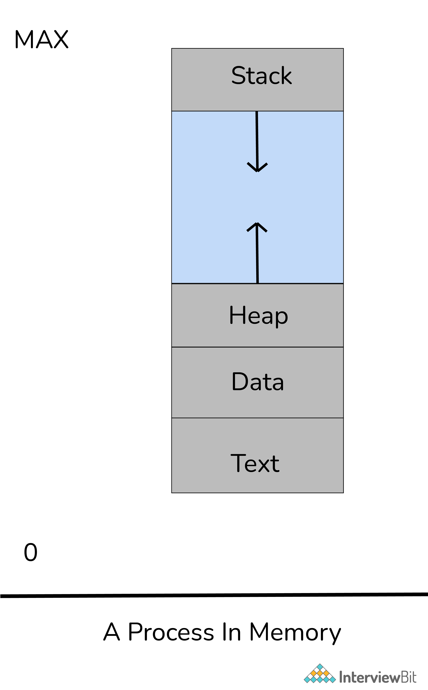

# Process Sections

- **Stack**: It is used for local variables and returns addresses. 
- **Heap**: It is used for dynamic memory allocation.
- **Data**: It stores global and static variables.
- **Code**: or text: It comprises compiled program code.

