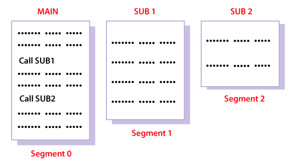

# Segmentation

Different from `paging`, where a process is divided into equal-sized unit, segmentation provides the flexibility
for user to divide the process and load into memory in different chunk of segments based on their logical
relevance.

## Why Segmentation is required?

Paging is more close to the Operating system rather than the User. 
It divides all the processes into the form of pages regardless of the fact that a process can have some relative 
parts of functions which need to be loaded in the same page.

Operating system doesn't care about the User's view of the process. It may divide the same function into different pages 
and those pages may or may not be loaded at the same time into the memory. It decreases the efficiency of the system.

It is better to have segmentation which divides the process into the segments. Each segment contains the same type of functions 
such as the main function can be included in one segment and the library functions can be included in the other segment.

